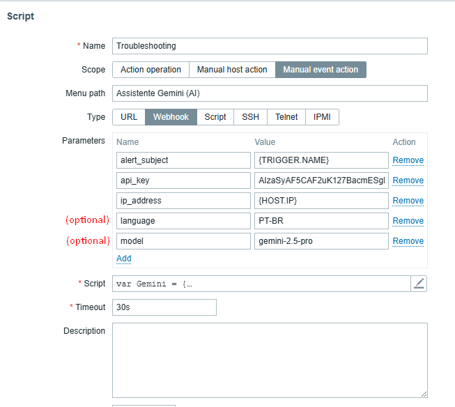
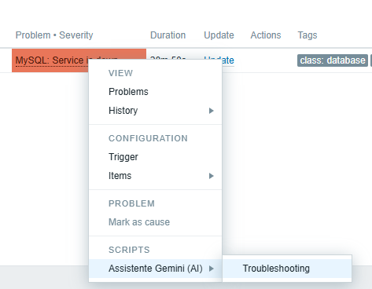

# ScritptZabbixIASupport 🚨🤖

This project integrates **Zabbix** with the **Gemini API (Google AI)** to provide automatic and intelligent responses to monitoring alerts.  
It generates concise outputs containing possible causes, debugging commands, and preventive measures.

## 📌 Requirements

* Zabbix 7.0 or higher
* A valid API key from [Gemini API](https://aistudio.google.com/app/apikey)
* Internet access for HTTP requests

## ⚙️ Required Parameters

The script expects the following parameters in the webhook `value` field:

* `alert_subject`: `{TRIGGER.NAME}`
* `ip_address`: `{HOST.IP}`
* `api_key`: `YOUR_GEMINI_KEY`

## 🌤️ Optional Parameters

* `language`: Defines the response language (e.g., `"Portuguese"`, `"pt-BR"`, `"Spanish"`).
  If not provided, the script will suggest that the user configure this parameter. The default is **English**.

* `model`: Defines the Gemini model to be used (e.g., `"gemini-2.0-flash"`).
  If not provided, the script will use the default model configured in the code.

## 🧠 What the Script Does

1. **Validation** → Checks whether the required parameters are present and not empty.
2. **Formatting** → Builds a message with the alert details and requests a concise response from Gemini.
3. **Request** → Sends the message to the Gemini API and processes the response.
4. **Language Suggestion** → If the `language` parameter is not provided, adds a tip suggesting its configuration.

## 🛠️ Example Usage in Zabbix

1. In the panel, go to **Alerts > Scripts > Create Script**.
2. Configure the webhook value as shown below:

```json
{
  "alert_subject": "{TRIGGER.NAME}",
  "ip_address": "{HOST.IP}",
  "api_key": "YOUR_GEMINI_KEY",
  "language": "PT-BR",
  "model": "gemini-2.0-flash"
}
```



3. Access the alert panel and select a specific alert to view the response.



## 📝 Example of Generated Response

> The alert: High CPU Usage, with the IP: 192.168.1.10 occurred in Zabbix.
> Possible causes:
> * High load due to intensive processes
> * Insufficient resources
>
> Suggested actions:  
> * Check running processes  
> * Optimize resource usage  
> * Consider hardware upgrades  

## ⭐ Star History

<a href="https://www.star-history.com/#rodrigoprazim/ScritptZabbixIASupport&Date">
 <picture>
   <source media="(prefers-color-scheme: dark)" srcset="https://api.star-history.com/svg?repos=rodrigoprazim/ScritptZabbixIASupport&type=Date&theme=dark" />
   <source media="(prefers-color-scheme: light)" srcset="https://api.star-history.com/svg?repos=rodrigoprazim/ScritptZabbixIASupport&type=Date" />
   
 </picture>
</a>
